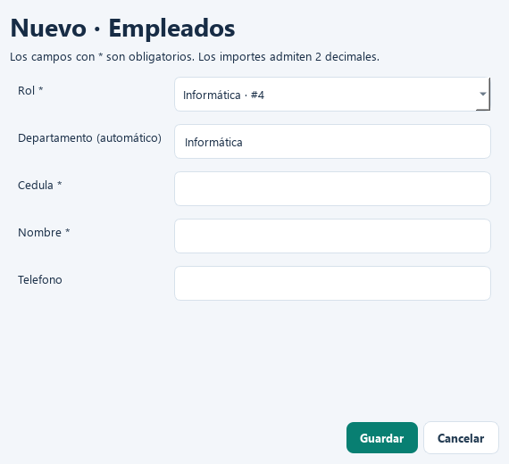
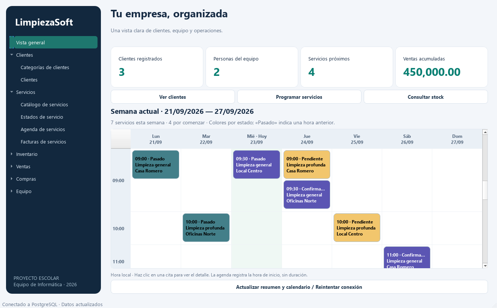

# LimpiezaSoft

Aplicación de escritorio en Python para un proyecto escolar del equipo de Informática. Permite gestionar los registros de una empresa de limpieza con PostgreSQL y una interfaz moderna en español, construida con PySide6.


Vista del panel con una base de ejemplo vacía.

## Documentación de diseño

Los documentos están en formato **HTML con gráficos SVG**, disponibles sin conexión a Internet:

- [Índice de diseño](design/index.html).
- [Arquitectura de tres capas](design/index.html#arquitectura).
- [Diagramas de casos de uso](design/casos-de-uso.html) y [fichas de los 12 casos](design/casos-de-uso.html#fichas).
- [Diagramas de entidad–relación](design/entidad-relacion.html): [equipo](design/entidad-relacion.html#equipo), [clientes y servicios](design/entidad-relacion.html#servicios), [inventario](design/entidad-relacion.html#inventario), [ventas](design/entidad-relacion.html#ventas) y [compras](design/entidad-relacion.html#compras).
- [Diccionario de las 25 tablas](design/entidad-relacion.html#diccionario).
- [Diagramas de secuencia](design/secuencias.html): [calendario](design/secuencias.html#calendario), [consulta](design/secuencias.html#consulta), [guardado](design/secuencias.html#guardar), [ventas](design/secuencias.html#venta), [pagos](design/secuencias.html#pago), [compras](design/secuencias.html#compra) y [eliminación](design/secuencias.html#eliminar).
- [Decisiones de diseño](design/index.html#decisiones) y [trazabilidad](design/index.html#trazabilidad).

Abre `design/index.html` en tu navegador. Cada diagrama incluye enlaces para abrir y descargar su SVG. GitHub muestra el código fuente de los HTML; para ver las páginas, abre la copia local. El generador [design/generar.py](design/generar.py) permite regenerar los documentos usando solamente Python y `db.sql`.

## Funciones

- Panel de resumen con clientes, empleados, servicios próximos y ventas acumuladas.
- Calendario de la semana actual, de lunes a domingo y por hora local, con todas las citas de la semana y detalle al hacer clic.
- Colores configurables por estado de servicio mediante un selector visual; el color se refleja en las citas del calendario.
- Rol laboral del empleado con departamento asignado automáticamente al crear o editar.
- Alta, consulta, edición y eliminación en las **25 tablas** del esquema original.
- Navegación por Clientes, Equipo, Servicios, Inventario, Ventas y Compras.
- Búsqueda en los campos visibles, paginación de 100 registros y selección de relaciones por nombre e identificador.
- Formularios con fechas, casillas booleanas y validación de campos obligatorios, longitudes e importes.
- Totales de ventas y compras recalculados al agregar, modificar, mover o eliminar detalles.
- Validación de pagos para evitar superar el total de la orden. Una operación inválida revierte la transacción completa.
- Contraseñas de usuarios almacenadas como hash PBKDF2-SHA256 con sal aleatoria; nunca se muestran en las tablas.
- Consultas en segundo plano para que la ventana siga respondiendo durante la conexión.

## Arquitectura de tres capas

```text
main.py                         Ensambla las capas y arranca la aplicación
start.bat                       Inicio con doble clic en Windows
design/                         Documentos HTML, diagramas SVG y generador
limpiezasoft/
  config.py                     Configuración desde variables de entorno
  datos/
    repositorio.py              SQL, conexiones, persistencia y transacciones
  negocio/
    modelos.py                  Entidades y metadatos de las 25 tablas
    servicios.py                Validaciones y casos de uso
    equipo.py                   Roles laborales y departamentos correspondientes
  ui/
    ventana.py                  Panel, listados, formularios y tareas asíncronas
    calendario.py               Calendario semanal y ventana de detalle de citas
    colores.py                  Selector visual y contraste de los colores
    tema.py                     Colores, tipografía y estilos Qt
tests/
  test_negocio.py                Pruebas sin base de datos
db.sql                          Esquema para inicializar PostgreSQL
.env.example                    Configuración de ejemplo sin secretos
requirements.txt                Dependencias de ejecución
```

El flujo es **UI → Negocio → Datos → PostgreSQL**. La UI no ejecuta SQL. La capa de negocio utiliza un repositorio inyectado, lo que permite probar las reglas sin conectarse a PostgreSQL. La capa de datos recibe los metadatos de las entidades y usa parámetros para los valores e identificadores SQL escapados.

Cada escritura usa una conexión transaccional: confirma al finalizar y revierte ante errores. Un bloqueo transaccional de PostgreSQL serializa las escrituras realizadas por esta aplicación para mantener coherentes los totales y pagos. Las modificaciones externas por SQL no ejecutan las reglas Python.

## Requisitos

- Windows con Python 3.11 o superior (64 bits); recomendado Python 3.12.
- PostgreSQL instalado y en ejecución, con una base llamada `proyecto`.
- Git para versionar el proyecto.

## Instalación en Windows

Desde PowerShell, dentro de la carpeta del proyecto:

```powershell
py -3.12 -m venv .venv
.\.venv\Scripts\python.exe -m pip install -r requirements.txt
Copy-Item .env.example .env
```

Si `.env` ya existe, consérvalo. Edita ese archivo con las credenciales locales:

```dotenv
DB_HOST=localhost
DB_PORT=5432
DB_NAME=proyecto
DB_USER=postgres
DB_PASSWORD=TU_CONTRASEÑA_LOCAL
```

El archivo `.env` está excluido de Git. Las variables del sistema tienen prioridad sobre sus valores. No incluyas credenciales reales en README, capturas o commits.

### Crear la base y las tablas

Si la base aún no existe, ejecuta en pgAdmin o `psql`, conectado a la base administrativa `postgres`:

```sql
CREATE DATABASE proyecto;
```

Con `.env` configurado, inicializa las tablas **una sola vez, en una base vacía**:

```powershell
.\.venv\Scripts\python.exe main.py --init-db
```

Si ya importaste las tablas, omite este paso. La inicialización no borra ni reemplaza tablas existentes; si encuentra un conflicto, revierte toda la operación. `db.sql` contiene el esquema actualizado, incluidas claves compuestas, identidades, columnas generadas y la asignación obligatoria de una empleada en la agenda.

#### Actualizar una base anterior sin asignación de limpiadora

La base local `proyecto` ya incluye `calendario_servicios.limpiadora_id`. No necesita cambios para esta corrección. En otra instalación que todavía no tenga esa columna, ejecuta:

```sql
ALTER TABLE calendario_servicios
    ADD COLUMN IF NOT EXISTS limpiadora_id INT REFERENCES empleados(empleado_id);
```

Asigna la limpiadora correcta a cada agenda existente desde la aplicación. Cuando todas tengan una asignación, establece la obligatoriedad:

```sql
ALTER TABLE calendario_servicios ALTER COLUMN limpiadora_id SET NOT NULL;
```

No se asigna una persona automáticamente a registros históricos.

#### Agregar colores a estados de servicio

La base local `proyecto` ya fue actualizada. Para otra instalación anterior, ejecuta el contenido de [migrations/001_color_estados_servicio.sql](migrations/001_color_estados_servicio.sql) en pgAdmin, conectado a la base del proyecto. Agrega `estados_servicio.color` como texto hexadecimal `#RRGGBB` con un color verde inicial y conserva los estados existentes. Las bases nuevas ya incluyen el campo en `db.sql`.

#### Agregar roles laborales a empleados

La base local también tiene aplicada [migrations/002_roles_empleados.sql](migrations/002_roles_empleados.sql). En otra instalación anterior, ejecuta ese archivo en pgAdmin. Agrega `empleados.rol_id`, crea o reutiliza los seis roles y sus departamentos, y registra las asociaciones en `departamentos_roles`. La inicialización con `main.py --init-db` también carga estos catálogos.

Los empleados anteriores conservan sus datos y su departamento, sin inferir un rol. La columna permite NULL para esos registros históricos, pero la aplicación exige seleccionar un rol al crear o editar un empleado. La migración puede volver a ejecutarse sin duplicar sus catálogos; reutiliza nombres con diferencias de acentos o mayúsculas.

### Iniciar

Haz doble clic en [start.bat](start.bat) o ejecuta desde PowerShell:

```powershell
.\start.bat
```

El script funciona aunque se invoque desde otra carpeta: ubica el proyecto, verifica `.venv` y las dependencias e inicia la aplicación. Si falta el entorno o alguna biblioteca, muestra cómo instalarlo. No cambia las credenciales ni inicializa la base automáticamente.

También puedes iniciar Python directamente:

```powershell
.\.venv\Scripts\python.exe main.py
```

La aplicación lee `.env` desde la raíz del proyecto. Si falla la conexión, muestra un mensaje y permite reintentar desde el panel de inicio.

## Primeros pasos

1. Registra empleados eligiendo uno de los roles laborales disponibles; el departamento se asigna automáticamente. Después crea usuarios y sus asociaciones, si corresponde.
2. Crea categorías de clientes y luego clientes.
3. Crea categorías de productos, productos y depósitos; registra existencias en **Stock por depósito**.
4. Crea estados y catálogo de servicios; en **Agenda de servicios** selecciona cliente, servicio, **limpiadora** (registrada en Empleados), estado y fecha. Luego registra su factura.
5. Registra una venta y luego sus detalles. El total empieza en cero y se calcula a partir de los detalles.
6. Crea proveedores, estados de compra y métodos de pago. Registra una orden, sus detalles y finalmente sus pagos.

Los identificadores se generan automáticamente. Las relaciones muestran nombres e identificadores; si una lista está vacía, registra primero los datos de su módulo. En tablas de asociación, ambos campos componen la clave primaria. Para conservar la contraseña de un usuario al editarlo, deja el campo vacío.

### Rol y departamento de cada empleado

En **Equipo → Empleados → Nuevo/Editar**, selecciona **Rol**. El campo **Departamento (automático)** muestra la asignación y es de solo lectura:

| Rol | Departamento |
| --- | --- |
| Limpiador | Clientes |
| Informática | Informática |
| Vendedor | Clientes |
| Manager | Administración |
| Contabilidad | Administración |
| Recursos humanos | HR |

Al guardar, Negocio vuelve a resolver la relación desde los catálogos y persiste rol y departamento en la misma transacción. Cambiar el rol también actualiza el departamento. Los roles laborales no modifican automáticamente los roles de acceso de `usuario_roles`.



### Calendario semanal y colores

En **Vista general** se muestra la semana actual de lunes a domingo, con columnas por día y filas de 00:00 a 23:00. Desplázate para consultar otras horas. Cada tarjeta indica la hora de inicio, el servicio y el cliente; las citas anteriores llevan la marca «Pasado». Si varias citas coinciden en una hora, se muestran por separado.

Haz clic en una cita para ver cliente, RUC/CI, teléfono, dirección, limpiadora asignada, estado, precio base y factura cuando exista. El calendario utiliza la hora local del equipo y no supone una duración, porque el esquema solo almacena la hora de inicio.

Para elegir colores, abre **Servicios → Estados de servicio → Nuevo/Editar**, pulsa **Elegir color** y guarda. Al volver a **Vista general** se cargan los nuevos colores. El botón **Actualizar resumen y calendario** también permite recargar los datos. El nombre del estado se mantiene en el detalle para no depender solamente del color.



Ejemplo ilustrativo con datos simulados; no agrega registros a la base de datos.

## Alcance escolar y decisiones de negocio

- Los importes usan `Decimal` y hasta dos decimales; no se presupone una moneda.
- Las fechas se introducen en la hora local del equipo y se almacenan con zona horaria en PostgreSQL.
- El panel cuenta como próximos los servicios con fecha futura, independientemente de su estado.
- Las categorías guardan descuentos; no se aplican automáticamente a ventas ni facturas porque el esquema no define cómo hacerlo. El precio del detalle y el monto de la factura son explícitos.
- Ventas y compras **no descuentan ni aumentan automáticamente el stock**: sus detalles no incluyen depósito. El stock se administra por separado. Las conciliaciones registran la comparación y PostgreSQL calcula la diferencia, pero no modifican existencias.
- Usuarios y roles se administran como datos. Esta versión no incluye inicio de sesión ni autorización por rol.
- Las facturas son registros internos del proyecto; no se integra facturación fiscal ni emisión de comprobantes.
- Las eliminaciones solicitan confirmación y respetan las reglas `CASCADE` y restricciones del esquema.
- Las listas principales tienen paginación; los selectores de relaciones cargan sus catálogos completos, adecuado para el volumen escolar.

## Pruebas

```powershell
.\.venv\Scripts\python.exe -m unittest discover -s tests -v
.\.venv\Scripts\python.exe -m compileall -q limpiezasoft main.py
```

Las pruebas de negocio cubren importes inválidos, cantidades, descuentos, fechas, hashes, campos calculados, recálculo de ambos padres al mover un detalle y reversión ante sobrepagos. Las pruebas unitarias no modifican la base real.

Para ejecutar también la integración PostgreSQL, con `.env` configurado:

```powershell
$env:RUN_DB_TESTS = '1'
.\.venv\Scripts\python.exe -m unittest discover -s tests -v
.\.venv\Scripts\python.exe tests\smoke_ui.py
```

La integración crea un esquema aislado con nombre aleatorio y revierte su transacción al finalizar; necesita permiso para crear esquemas. Comprueba las 25 entidades, altas y ediciones, totales, eliminaciones y reversión de pagos inválidos. La prueba visual usa datos vacíos simulados y genera `docs/interfaz.png` sin abrir ventanas ni escribir en PostgreSQL.

## Git

Repositorio: [sofiabustafer/limpiezasoft](https://github.com/sofiabustafer/limpiezasoft).

Para obtener el proyecto en otro equipo:

```powershell
git clone https://github.com/sofiabustafer/limpiezasoft.git
cd limpiezasoft
```

Para registrar cambios posteriores:

```powershell
git status
git add .
git commit -m "Describe el cambio realizado"
git push origin main
```

Se versionan fuentes, esquema, pruebas y documentación. `.env`, `.venv`, cachés y archivos generados quedan excluidos. La base de datos y sus registros no se guardan en Git.

## Referencias técnicas

- [Qt for Python / PySide6](https://doc.qt.io/qtforpython-6/)
- [Transacciones con Psycopg 3](https://www.psycopg.org/psycopg3/docs/basic/transactions.html)
- [Composición segura de SQL](https://www.psycopg.org/psycopg3/docs/api/sql.html)
