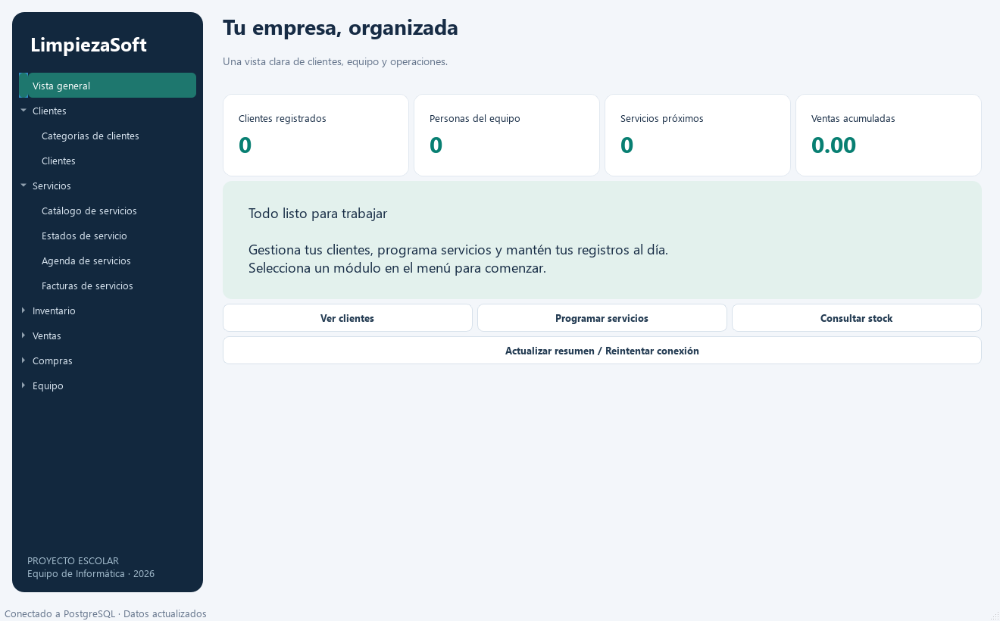

# LimpiezaSoft

Aplicación de escritorio en Python para un proyecto escolar del equipo de Informática. Permite gestionar los registros de una empresa de limpieza con PostgreSQL y una interfaz moderna en español, construida con PySide6.



Vista del panel con una base de ejemplo vacía.

## Funciones

- Panel de resumen con clientes, empleados, servicios próximos y ventas acumuladas.
- Alta, consulta, edición y eliminación en las **25 tablas** del esquema original.
- Navegación por Clientes, Equipo, Servicios, Inventario, Ventas y Compras.
- Búsqueda en los campos visibles, paginación de 100 registros y selección de relaciones por nombre e identificador.
- Formularios con fechas, casillas booleanas y validación de campos obligatorios, longitudes e importes.
- Totales de ventas y compras recalculados al agregar, modificar, mover o eliminar detalles.
- Validación de pagos para evitar superar el total de la orden. Una operación inválida revierte la transacción completa.
- Contraseñas de usuarios almacenadas como hash PBKDF2-SHA256 con sal aleatoria; nunca se muestran en las tablas.
- Consultas en segundo plano para que la ventana siga respondiendo durante la conexión.

## Arquitectura de tres capas

```text
main.py                         Ensambla las capas y arranca la aplicación
limpiezasoft/
  config.py                     Configuración desde variables de entorno
  datos/
    repositorio.py              SQL, conexiones, persistencia y transacciones
  negocio/
    modelos.py                  Entidades y metadatos de las 25 tablas
    servicios.py                Validaciones y casos de uso
  ui/
    ventana.py                  Panel, listados, formularios y tareas asíncronas
    tema.py                     Colores, tipografía y estilos Qt
tests/
  test_negocio.py                Pruebas sin base de datos
db.sql                          Esquema para inicializar PostgreSQL
db.sql.txt                      Archivo original recibido
.env.example                    Configuración de ejemplo sin secretos
requirements.txt                Dependencias de ejecución
```

El flujo es **UI → Negocio → Datos → PostgreSQL**. La UI no ejecuta SQL. La capa de negocio utiliza un repositorio inyectado, lo que permite probar las reglas sin conectarse a PostgreSQL. La capa de datos recibe los metadatos de las entidades y usa parámetros para los valores e identificadores SQL escapados.

Cada escritura usa una conexión transaccional: confirma al finalizar y revierte ante errores. Un bloqueo transaccional de PostgreSQL serializa las escrituras realizadas por esta aplicación para mantener coherentes los totales y pagos. Las modificaciones externas por SQL no ejecutan las reglas Python.

## Requisitos

- Windows con Python 3.11 o superior (64 bits); recomendado Python 3.12.
- PostgreSQL instalado y en ejecución, con una base llamada `proyecto`.
- Git para versionar el proyecto.

## Instalación en Windows

Desde PowerShell, dentro de la carpeta del proyecto:

```powershell
py -3.12 -m venv .venv
.\.venv\Scripts\python.exe -m pip install -r requirements.txt
Copy-Item .env.example .env
```

Si `.env` ya existe, consérvalo. Edita ese archivo con las credenciales locales:

```dotenv
DB_HOST=localhost
DB_PORT=5432
DB_NAME=proyecto
DB_USER=postgres
DB_PASSWORD=TU_CONTRASEÑA_LOCAL
```

El archivo `.env` está excluido de Git. Las variables del sistema tienen prioridad sobre sus valores. No incluyas credenciales reales en README, capturas o commits.

### Crear la base y las tablas

Si la base aún no existe, ejecuta en pgAdmin o `psql`, conectado a la base administrativa `postgres`:

```sql
CREATE DATABASE proyecto;
```

Con `.env` configurado, inicializa las tablas **una sola vez, en una base vacía**:

```powershell
.\.venv\Scripts\python.exe main.py --init-db
```

Si ya importaste las tablas del archivo original, omite este paso. La inicialización no borra ni reemplaza tablas existentes; si encuentra un conflicto, revierte toda la operación. `db.sql` conserva el esquema de `db.sql.txt`, incluidas claves compuestas, identidades y columnas generadas.

### Iniciar

```powershell
.\.venv\Scripts\python.exe main.py
```

La aplicación lee `.env` desde la raíz del proyecto. Si falla la conexión, muestra un mensaje y permite reintentar desde el panel de inicio.

## Primeros pasos

1. Crea departamentos, roles y empleados; después, usuarios y sus asociaciones.
2. Crea categorías de clientes y luego clientes.
3. Crea categorías de productos, productos y depósitos; registra existencias en **Stock por depósito**.
4. Crea estados y catálogo de servicios; programa una fecha en **Agenda de servicios** y registra su factura.
5. Registra una venta y luego sus detalles. El total empieza en cero y se calcula a partir de los detalles.
6. Crea proveedores, estados de compra y métodos de pago. Registra una orden, sus detalles y finalmente sus pagos.

Los identificadores se generan automáticamente. Las relaciones muestran nombres e identificadores; si una lista está vacía, registra primero los datos de su módulo. En tablas de asociación, ambos campos componen la clave primaria. Para conservar la contraseña de un usuario al editarlo, deja el campo vacío.

## Alcance escolar y decisiones de negocio

- Los importes usan `Decimal` y hasta dos decimales; no se presupone una moneda.
- Las fechas se introducen en la hora local del equipo y se almacenan con zona horaria en PostgreSQL.
- El panel cuenta como próximos los servicios con fecha futura, independientemente de su estado.
- Las categorías guardan descuentos; no se aplican automáticamente a ventas ni facturas porque el esquema no define cómo hacerlo. El precio del detalle y el monto de la factura son explícitos.
- Ventas y compras **no descuentan ni aumentan automáticamente el stock**: sus detalles no incluyen depósito. El stock se administra por separado. Las conciliaciones registran la comparación y PostgreSQL calcula la diferencia, pero no modifican existencias.
- Usuarios y roles se administran como datos. Esta versión no incluye inicio de sesión ni autorización por rol.
- Las facturas son registros internos del proyecto; no se integra facturación fiscal ni emisión de comprobantes.
- Las eliminaciones solicitan confirmación y respetan las reglas `CASCADE` y restricciones del esquema.
- Las listas principales tienen paginación; los selectores de relaciones cargan sus catálogos completos, adecuado para el volumen escolar.

## Pruebas

```powershell
.\.venv\Scripts\python.exe -m unittest discover -s tests -v
.\.venv\Scripts\python.exe -m compileall -q limpiezasoft main.py
```

Las pruebas de negocio cubren importes inválidos, cantidades, descuentos, fechas, hashes, campos calculados, recálculo de ambos padres al mover un detalle y reversión ante sobrepagos. Las pruebas unitarias no modifican la base real.

Para ejecutar también la integración PostgreSQL, con `.env` configurado:

```powershell
$env:RUN_DB_TESTS = '1'
.\.venv\Scripts\python.exe -m unittest discover -s tests -v
.\.venv\Scripts\python.exe tests\smoke_ui.py
```

La integración crea un esquema aislado con nombre aleatorio y revierte su transacción al finalizar; necesita permiso para crear esquemas. Comprueba las 25 entidades, altas y ediciones, totales, eliminaciones y reversión de pagos inválidos. La prueba visual usa datos vacíos simulados y genera `docs/interfaz.png` sin abrir ventanas ni escribir en PostgreSQL.

## Git

Repositorio: [sofiabustafer/limpiezasoft](https://github.com/sofiabustafer/limpiezasoft).

Para obtener el proyecto en otro equipo:

```powershell
git clone https://github.com/sofiabustafer/limpiezasoft.git
cd limpiezasoft
```

Para registrar cambios posteriores:

```powershell
git status
git add .
git commit -m "Describe el cambio realizado"
git push origin main
```

Se versionan fuentes, esquema, pruebas y documentación. `.env`, `.venv`, cachés y archivos generados quedan excluidos. La base de datos y sus registros no se guardan en Git.

## Referencias técnicas

- [Qt for Python / PySide6](https://doc.qt.io/qtforpython-6/)
- [Transacciones con Psycopg 3](https://www.psycopg.org/psycopg3/docs/basic/transactions.html)
- [Composición segura de SQL](https://www.psycopg.org/psycopg3/docs/api/sql.html)
